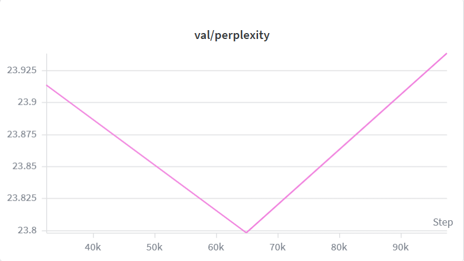
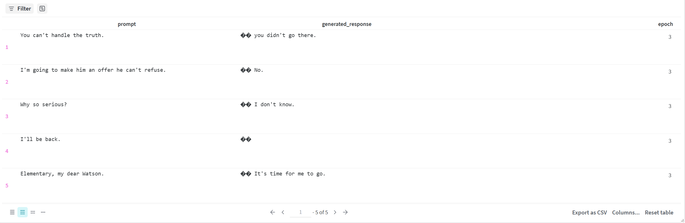
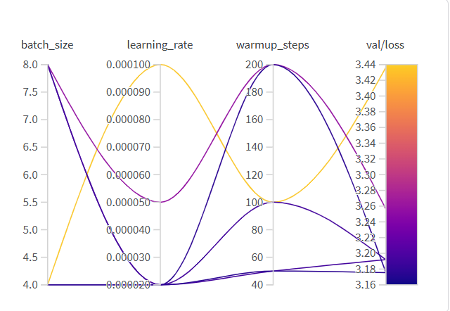

## **Name:** CineChat - Movie Dialogue Generation with Fine-Tuned GPT-2

**Overview:** Generate movie dialogue-style responses to arbitrary input lines by fine-tuning GPT-2 Small (124M parameters) on the Cornell Movie Dialogs Corpus (220k+ exchanges across 617 films). Prompt–response pairs are formatted with `<prompt>` / `<response>` boundary tokens, and the model is trained with cross-entropy loss applied to response tokens only. A Gradio interface exposes temperature, top-p, and token-length controls for interactive generation.


## **Extra Criteria:**

**Metrics tracking:** W&B logs training loss, learning rate, and gradient norm at every step, and validation perplexity at every epoch. A fixed set of five iconic movie lines is passed through the model at the end of each epoch and logged as a W&B Table, making it possible to watch response quality evolve side-by-side across epochs and runs.





**Hyperparameter tuning:** A W&B random sweep searched over learning rate `{2e-5, 5e-5, 1e-4}`, batch size `{4, 8, 16}`, and warmup steps `{50, 100, 200}` across 6 full training runs, optimizing for minimum `val/loss`. The sweep identified `lr=2e-5` as the dominant factor, it occupied all four top-ranked runs, while the default `lr=5e-5` matched the worst completed config and `lr=1e-4` badly overfit (val/ppl 31.06).



**Data versioning:** The tokenized Cornell corpus is logged to W&B as a versioned artifact (`cornell-tokenized:v0`) with metadata including split sizes, max sequence length, context turns, and random seed. Each training run calls `use_artifact("cornell-tokenized:latest")`, creating a traceable data -> model lineage graph in W&B.


## **Evaluation Metrics:**

### Hyperparameter sweep results (sweep `ib1n4be3`)

| Run | Learning Rate | Batch Size | Warmup Steps | Val Perplexity |
|---|---:|---:|---:|---:|
| vibrant-sweep-5 | 2e-5 | 4 | 50 | **23.94** |
| sweepy-sweep-6 | 2e-5 | 4 | 200 | 23.95 |
| earnest-sweep-4 | 2e-5 | 8 | 50 | 24.33 |
| legendary-sweep-1 | 2e-5 | 8 | 100 | 24.33 |
| efficient-sweep-2 | 5e-5 | 8 | 200 | 25.96 |
| driven-sweep-3 (worst) | 1e-4 | 4 | 100 | 31.06 |

### Local baseline vs. best sweep checkpoint

| | Local Baseline | Best Sweep (vibrant-sweep-5) |
|---|---:|---:|
| Val perplexity | 25.97 | **23.94** |
| Test perplexity | 25.06 | — |

**Interpretation:** the sweep improved validation perplexity by ~8% over the local default config (`lr=5e-5, bs=8, warmup=100`). Lower learning rate with small batch size generalized best on movie dialogue, consistent across all four top-ranked runs. Test metrics were not logged for sweep runs (sweep agent calls `train()` only, not `test()`); the local baseline test/ppl of 25.06 serves as the held-out reference.


## **Difficulties & fixes**


**Problem:** Generated responses began with garbled `�` or `Ġ` characters.

**Fix:** Two-part fix: (1) explicitly pass `attention_mask` to `model.generate()` to resolve GPT-2's pad==eos ambiguity; (2) strip U+FFFD and U+0120 from the decoded response string.


## Setup

### Step 1: Environment

1. Python 3.10+ with a fresh virtualenv recommended.
2. Install dependencies:

   ```bash
   pip install -r requirements.txt
   ```

3. `requirements.txt` targets CUDA 12.1 PyTorch. If you are on CPU-only or a different CUDA version, reinstall `torch` and `torchvision` from https://pytorch.org for your setup.

### Step 2: Create `.env`

Create a file named `.env` in the project root. It must contain your Kaggle credentials (to download the corpus) and your W&B API key (for experiment tracking). **Never commit this file, it is listed in `.gitignore`.**

```
KAGGLE_USERNAME=your_kaggle_username
KAGGLE_KEY=your_kaggle_api_key
WANDB_KEY=your_wandb_api_key
```

- Kaggle credentials: kaggle.com -> Account -> API -> Create New Token.
- W&B API key: wandb.ai -> User Settings -> API Keys.

### Step 3: Download the Cornell corpus

```bash
python load_data.py
```

Downloads and unpacks the Cornell Movie Dialogs Corpus into `data/raw/`.

### Step 4: Preprocess

```bash
python preprocess.py
```

Parses the corpus, builds prompt→response pairs, applies a 60/20/20 movie-level train/val/test split (seed=42), tokenizes to max length 128, and saves a HuggingFace `DatasetDict` to `data/processed/tokenized/`. Also logs the dataset as a W&B Artifact (`cornell-tokenized:v0`).

### Step 5: Train

**Single run (default hyperparameters):**

```bash
python train.py
```

**Hyperparameter sweep (6 random configs, requires W&B):**

```bash
python train.py --sweep
```

**Evaluate best checkpoint on test set only:**

```bash
python train.py --test-only
```

Checkpoints are saved to `checkpoints/epoch-N/` after each epoch and to `checkpoints/best/` whenever validation loss improves.

### Step 6: Generate responses

```bash
python generate.py --prompt "You can't handle the truth."
```

Optional flags: `--checkpoint`, `--max-new-tokens`, `--temperature`, `--top-p`.

### Step 7: Launch the Gradio app

```bash
python app.py
```

Opens a local UI with sliders for temperature (0.5-1.5), top-p (0.8-1.0), and max new tokens (20-150). Add `--share` for a public Gradio link.


### Quick reference

| Task | Command |
|---|---|
| Download data | `python load_data.py` |
| Preprocess | `python preprocess.py` |
| Train (single run) | `python train.py` |
| Hyperparameter sweep | `python train.py --sweep` |
| Evaluate test set | `python train.py --test-only` |
| CLI inference | `python generate.py --prompt "..."` |
| Gradio UI | `python app.py` |
